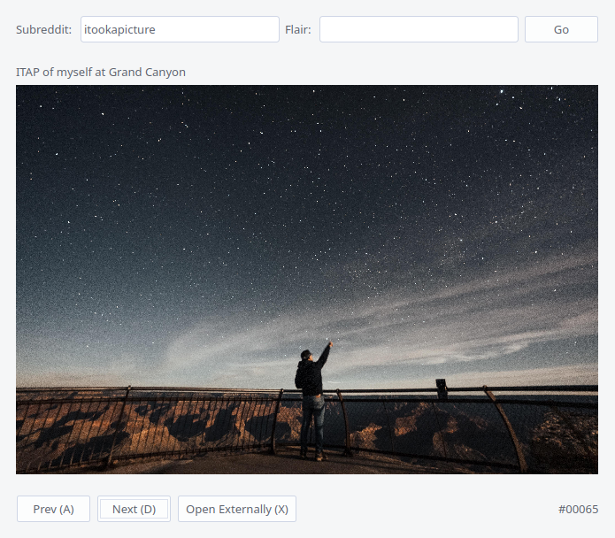

# RedditFlair
A Reddit image client which bypasses the 1000 post limit using the [pushshift API](https://github.com/pushshift/api ), and can filter by flair.<br>
Also supports the prefetching and lazy-loading of images for a more responsive experience.

<p align="center">
  
</p>

Reddit has a global [1000 post limit on listings](https://www.reddit.com/8zhcmr ), which is reached especially quickly when filtering posts by a flair. 
The ability to natively query by timestamp was also recently dropped, meaning that the only way to search for submissions past the 1000 new/hot/top ones
is to use a 3rd party api, such as the [pushshift API](https://github.com/pushshift/api ).

While gallery browsers for Reddit do exist, I couldn't find any that were not subject to this limitation because they didn't use 3rd party APIs. Hence, RedditFlair

# Usage
### Downloading/Installing
`cd` into the directory where you want to put the program, then:

```
git clone https://github.com/pixelzery/RedditFlair.git
cd RedditFlair
python3 -m pip install -r requirements.txt
```

### Authorisation
You will need to authorise this script to work with Reddit. It's fine, it takes like 10 seconds.
1. Go to https://www.reddit.com/prefs/apps, scroll to the bottom and click on "are you a developer? create an app..."
2. Select 'installed app'
3. Give it a name -- something like 'flair'
4. Set the redirect url to: http://localhost:8298
5. Click 'create app'
6. Reddit will give you a code, this is your `client_id`
7. Edit the `auth.json` file in this repo and paste into the `client_id` field
8. As per the Reddit API guidelines, enter an identifiable string in the `user_agent` field -- something like `RedditFlair instance by u/<your username> https://git.io/J3PPe`

### Launch
```
python3 main.py
```
